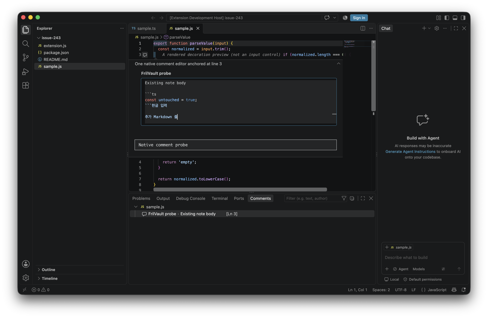
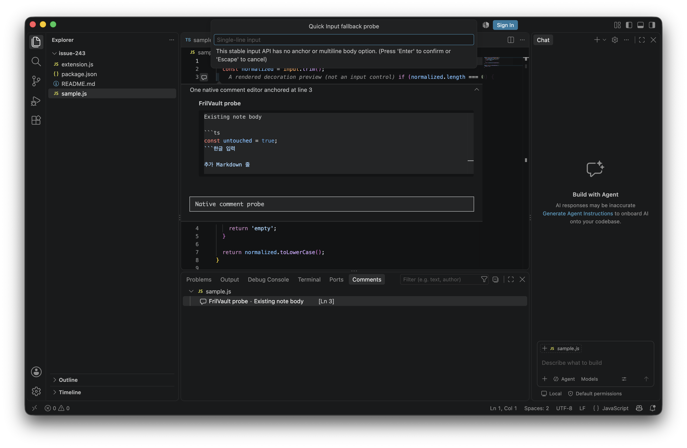

# Issue #243 — VS Code editor input feasibility

**Status: no-go for the current UI contract.** On VS Code 1.140.0 stable for macOS arm64, the preferred decoration surface has no public input control, and the tested native Comments surface edits Markdown but pushes source lines down and does not provide a separate tags field. Quick Input is single-line and detached from the anchor. These tested APIs do not meet either the preferred surface or the accepted floating fallback in [#243](https://github.com/FrilLab/frilvault/issues/243).

This report is the feasibility deliverable requested by the issue. It does not claim that the code-adjacent editor or autosave is implemented. The PR should remain a Draft and reference #243; a maintainer decision is needed before changing the agreed layout/tag contract.

## Test setup

- Visual Studio Code stable 1.140.0, commit `07b4ff1883f94da91f6d698744fc7c3638b59720`, downloaded and launched by the repository's `@vscode/test-cli` on macOS arm64.
- macOS kernel `Darwin 25.6.0`.
- Extension engine minimum: `^1.125.0`; `@types/vscode` is 1.125.0. The Extension Host run was on 1.140.0; 1.125.0 itself was not launched.
- Reproducible probe: [`apps/vscode-extension/feasibility/issue-243`](../apps/vscode-extension/feasibility/issue-243/README.md). Launch it in a disposable VS Code process using the command in its README. It creates one decoration preview and one native comment thread at line 3 of `sample.js`; the command palette also opens a `window.showInputBox` example.
- The probe has no persistence, does not access VS Code's DOM or Monaco, and never edits the text document. Before/after SHA-256 for `sample.js` was `4519269f846c489c5b2d423c1f91134973c2e57aa7058659a6303afb6ecc0eed`.

## Results

| Stable API | What the Extension Host showed | Contract result |
| --- | --- | --- |
| `TextEditorDecorationType.after.contentText` | Renders the note preview text after line 3. The decoration API exposes rendering options and hover messages; it exposes no textbox or input events. | A decoration is not an editor. It cannot host the required multiline body/tags surface. |
| `window.showInputBox` | Shows the prompt at the top of the editor area. `InputBoxOptions` has a string value, but no anchor position or multiline body option. | Cannot edit multiline Markdown and cannot remain beside the source anchor. |
| `CommentController.createCommentThread` / `CommentMode.Editing` | Opens VS Code's real Markdown comment editor on line 3. The field accepted multiple lines and Hangul text sent as Unicode text input. The native widget occupies a large block under the anchor; subsequent source rows appear below it. | The widget visibly moves source content vertically and its native dimensions are outside extension control. It provides a comment body and discussion reply, not distinct note-body and tag fields. It misses the agreed fallback and editing contract. |
| `WebviewPanel` | Official API places a webview panel in an editor view column. | It does not provide a stable public floating overlay or anchored position. Using it as the input surface opens a separate editor pane and changes layout. |
| CodeLens / Markdown Hover | The existing extension already renders CodeLens actions and Markdown Hover/decoration content. Neither surface provides editable form controls. | Useful for entry points and read-only preview, not an input editor. |

The first screenshot shows the expanded native comment editor below the third source line. Code lines continue underneath the comment block, rather than retaining their prior positions. It also shows the single comment-body field; there is no separate tags input.

The second screenshot shows Quick Input at the top of the editor area while the comment remains at line 3. The prompt is detached from the anchor and accepts a single line.

In the native comment textbox, a multiline value containing Hangul was entered through Chromium DevTools Protocol `Input.insertText`. This demonstrates that the native textbox can receive multiline Unicode. It does **not** establish that a real Korean IME composition, keyboard-only navigation, accessibility, delayed close, or final-keystroke durability behaves correctly. Those tests were not completed because the surface already fails the required layout and tag-field criteria.

The Extension Host captured the screenshots; no source-document edits occurred. The probe code, commands, sample file and full-screen UI capture are included so reviewers can reproduce these findings. It has not been tested in Windows/Linux or VS Code 1.125.0.

## Concrete choices for a follow-up decision

1. **Allow a native Comments editor.** Accept the vertical space taken below an anchor and define how tags are encoded or entered. If this changes, autosave, cancellation and conflict semantics still need a separate end-to-end implementation and acceptance run.
2. **Allow the existing webview editor in a side column or tab.** This supports multiline Markdown and separate tags through existing editor lifecycle, but changes the current no-side-pane/no-tab UX requirement.
3. **Keep the current UI contract and defer implementation.** Revisit when the stable VS Code API exposes a public anchored input/widget surface that can keep layout fixed.

No option was selected on behalf of the maintainer. Proposed/private VS Code APIs, DOM injection, internal Monaco APIs, a new native-window integration and source edits remain outside this probe.

## Official references and repository checks

- [VS Code API reference](https://code.visualstudio.com/api/references/vscode-api) and the pinned [`@types/vscode` 1.125.0](../apps/vscode-extension/package.json) used by the extension.
- [DecorationRenderOptions](https://code.visualstudio.com/api/references/vscode-api#DecorationRenderOptions) documents decoration rendering.
- [CommentThread and CommentController](https://code.visualstudio.com/api/references/vscode-api#CommentThread) document range-bound comment threads and their text/comment properties.
- [InputBox](https://code.visualstudio.com/api/references/vscode-api#InputBox) documents Quick Input text entry.
- [Webview guide](https://code.visualstudio.com/api/extension-guides/webview) documents the supported panel/view hosting model.
- Existing supported surfaces: `apps/vscode-extension/src/features/note-viewer/noteViewerController.ts`, `noteViewerRenderer.ts`, `noteViewerModel.ts`, and `features/presentation/noteHover.ts`.
- Existing Extension Host baseline before the probe: `npm test` passed on VS Code 1.140.0, 265 passing, 1 pending.

Validation for this handoff: the final `npm test`, Rust formatting, `cargo check --workspace --all-features`, and `cargo clippy --workspace --all-targets --all-features -- -D warnings` passed. A default parallel `cargo test --workspace --all-features` run failed once in the existing tag color fixture with `DuplicateNoteAnchor`; the focused test passed alone, and `RUST_TEST_THREADS=1 cargo test --workspace --all-features` passed the workspace. The fixture creates its temporary directory from a timestamp and does not clear an existing path, so a parallel path collision is a likely cause. No Rust test code was changed in this issue branch.

## Not verified

The following are not claimed as tested or complete: actual Korean IME composition; all keyboard-only paths and screen-reader announcements; high-contrast/light-theme behavior; anchor tracking through scroll, resize, zoom, wrapping and split editors; dismissing a dirty Comments widget without loss; autosave, recovery, save failure, retry, conflict and real Vault reopen; #231/#241 persistence regressions in a new production surface; Windows/Linux; VS Code 1.125.0. They are implementation acceptance items if a maintainer changes the UI contract to an API surface that meets the layout and tag requirements.
